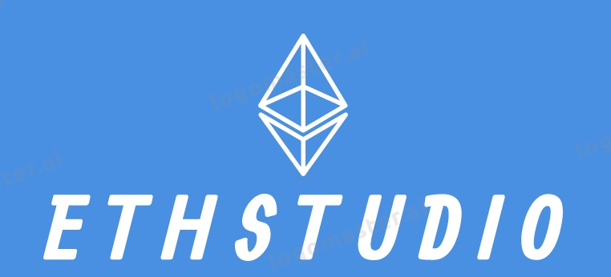

# EthStudio





# Subscriptions on Ethereum

- Stake based Subscriptions - ZERO COST subscriptions to a paid product/service on the ethereum - Smart Contracts + Compound v2 Lending Platform
- ZK based Privacy preserving Subscriptions using Range proofs powered by Aztec Protocol

### Contract on mainnet: 

 [Ethstudio](https://etherscan.io/address/0x14b5286D41c219B5Dc6744dA8FACEa62043dDCBB)

###  The Subscription Economy:

In the years following the 2008 crisis, subscription-model companies emerged in droves. Recognizing consumers’ preference for the financial consistency of purchasing a small amount over a longer period of time, innovators applied the subscription model to product “boxes,” household goods, media streaming services, and software products. And the innovation has paid off. B2C subscription businesses attracted more than 11 million customers in 2017, and more than 2,000 B2C subscription companies existed as of the end of the year. Since 2014, visitation to subscription company websites has increased more than 800%, with 37 million visitors. A McKinsey study in February of 2018 determined that 15% of online shoppers had subscribed to an e-commerce subscription over the past year. Notably, the streaming-media services (Netflix, etc.) had converted 46% of online shoppers into subscription customers. - ConsenSys Media


### Tools and Technology used by Us

1. **AZTEC Protocol**: Zero-knowledge proof

1. **React**: For frontend development environment

1. **Solidity** : Smart contract development

1. **Metamask** and **Ganache**

1. **Web3.js**

1. **ERC20** Tokens

We (EthStudio) believe that blockchain has an potential that can change course of human development.

Important Note:

```
Node        : > 10.16
Npm         : > 6.9.0
Solidity    : 0.4.21 <0.6.
web3        : 1.0.0-beta.5
```

Contributing team Members (with LinkedIn Website):

1. [Vyom Sharma](https://www.linkedin.com/in/vcrizpy/)

2. [Chirag Maliwal](https://linkedin.com/in/chirag-maliwal-92796a107)

3. [Shivam Kohli](https://www.linkedin.com/in/shivam-kohli-63670210a/)


### Contribution:

We built this in a weekend!You should inspect our smart contract before using.
100% free and open source! Please contribute! Cheers from `Ethstudio` team.